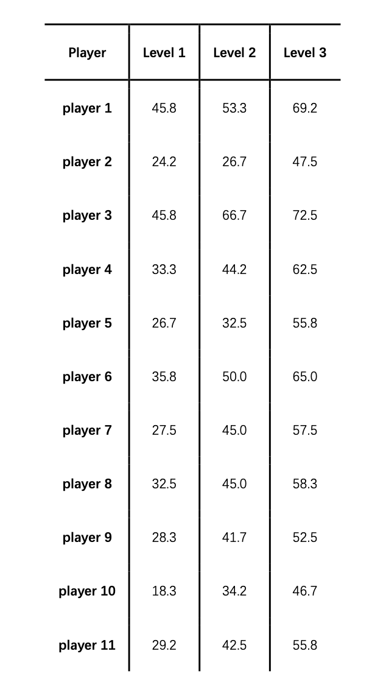

# 2025-group-24
2025 COMSM0166 group 24

## Your Game

Link to your game [PLAY HERE](https://uob-comsm0166.github.io/2025-group-24/)

Your game lives in the [/docs](/docs) folder, and is published using Github pages to the link above.

Include a demo video of your game here (you don't have to wait until the end, you can insert a work in progress video)

## Your Group

Add a group photo here!

| Name         | Email                    | Username    | Role                  |
|-------------|--------------------------|------------|-----------------------|
| Xinjie Gao  | [id24861@bristol.ac.uk](mailto:id24861@bristol.ac.uk)  | Gracie-Gao | Software Test Engineer |
| Zibin Liu   | [ys24930@bristol.ac.uk](mailto:ys24930@bristol.ac.uk)  | ZibinLiu   | Project Manager       |
| Xiaobo Ma   | [oa24686@bristol.ac.uk](mailto:oa24686@bristol.ac.uk)  | XiaoboMa1  | Software Test Engineer |
| Kailin Fang | [jd24317@bristol.ac.uk](mailto:kfnora398@gmail.com)      | catlin518  | UI Designer           |
| Yanhao He   | [ei24967@bristol.ac.uk](mailto:ei24967@bristol.ac.uk)  | YanHe225   | Developer             |

## Project Report

## 1. Introduction

- 5% ~250 words 
- Describe your game, what is based on, what makes it novel? 

## 2. Requirements 

- 15% ~750 words
- Use case diagrams, user stories. Early stages design. Ideation process. How did you decide as a team what to develop?

### 2.1 List of Stakeholders

- **Players:**  
  Expect a smooth gaming experience with challenging level designs and diverse weapon upgrade systems, enhancing the game's fun and sense of achievement.
- **Development Team:**  
  Aim to maintain clean and structured code, making it easy to maintain and expand with new features such as additional levels and multiplayer modes.
- **Product Manager:**  
  Hope the game is easy to learn, suitable for players of different age groups, with engaging gameplay that keeps players active for a long time.
- **Testers:**  
  Ensure the game runs stably, with no critical bugs, and smoothly supports both single-player and multiplayer modes to optimize the user experience.

### 2.2 User Stories & Acceptance Criteria

| **User Story** | **Acceptance Criteria** |
|----------------|--------------------------|
| **Epic 1: Core Gameplay** | |
| As a player, I want to control the airplane’s movement so that I can dodge enemy bullets and attack flexibly. | Given the airplane is in motion, when the player presses directional keys, then the airplane should respond smoothly without lag. |
| As a player, I want my airplane to gain points after shooting down an enemy airplane so that I can track my progress. | Given my airplane is in the game, when I successfully shoot down an enemy airplane, then I should gain points reflected in the score counter. |
| As a player, I want the airplane to lose health when hit by enemy bullets or crashes into enemy planes so that the game’s challenge increases. | Given the airplane has health points, when it is hit by bullets or crashes, then its health should decrease accordingly. |
| As a player, I want to unlock the next level after defeating a wave of enemy planes so that I can experience higher difficulty challenges. | Given the current wave is cleared, when the completion condition is met, then the next level should automatically unlock. |
| As a player, I want to play with friends on the same device for co-op mode so that I can increase fun. | Given I am on the game’s main menu, when I select the co-op mode option, then the game should allow two players to join on the same device. |
| **Epic 2: Game Interface & UX Optimization** | |
| As a player, I want to pause the game anytime so that I can take breaks without losing my progress. | Given the game is running, when the player presses pause, then the game should freeze. |
| As a player, I want to view historical high scores after the game ends so that I can motivate myself to improve. | Given the game has ended, when the player accesses the scoreboard, then the historical high scores should be displayed. |
| As a player, I want to switch between different game backgrounds so that I can enhance visual experience and freshness. | Given the settings menu is open, when the player selects a background, then the game should update the background. |
| As a game designer, I want to adjust the difficulty curve of each level so that the game remains challenging yet fair for all players. | Given the game’s progression system, when a player advances through levels, then the difficulty should increase gradually. |

### 2.3 Reflection

In the process of developing the airplane battle mini game, our team learned a lot about requirements analysis from Epics and User Stories. Here are our key takeaways:

Firstly, we realize the importance of requirement decomposition. By refining the requirements into specific user stories, we have helped define the core gameplay and additional features more clearly, making the developers' design goals more specific.

Secondly, we recognize that the clarity of acceptance criteria is crucial. While writing user stories, we have defined acceptance criteria for each story to ensure that the developed features meet the expected results.

Thirdly, we realize that a multi-stakeholder perspective is crucial for product development. Through stakeholder analysis, we realized that we need to not only consider the gaming experience of players, but also pay attention to the technical implementation difficulty of the development team and the expectations of product managers for market positioning, to ensure that the game can meet the needs of different stakeholders.

## 3. Design

- 15% ~750 words 
- System architecture. Class diagrams, behavioural diagrams.
- Class Diagram

- Sequence Diagram

## 4. Implementation

- 15% ~750 words

- Describe implementation of your game, in particular highlighting the three areas of challenge in developing your game. 

## 5. Evaluation

### **5.1 Qualitative Analysis**  

To evaluate the usability and player experience of the game, we conducted **Think Aloud** and **Heuristic Evaluation**. These two methods helped us identify key issues in the game, including controls, difficulty balance, and user interaction experience. Below are the detailed evaluation results and optimization plans.  

### **5.1.1 Think Aloud**  
We recruited 6 students as testers and asked them to complete two tasks:  
- **Task 1:** Pass the first two levels in single-player mode.  
- **Task 2:** Collect 5 items.  

During the test, we asked players to express their ideas loudly to record their operating habits and difficulties in the game. Through observation and analysis, we summarized the following main issues:  
- **Lack of a game tutorial:** The game does not provide any operation instructions, causing players to be unclear about how to control the aircraft when first entering the game. Some players had to try different keys to figure out the controls, which negatively impacted their experience.  
- **Low item spawn rate:** Testers could not collect 5 items after passing the first two levels, failing to meet our initial goal of using items as an innovation to attract players.  
- **High game difficulty:** Three players failed to pass the second level, indicating that the initial difficulty was set too high.  
- **Control scheme does not suit all players:** The current control scheme uses WASD for movement and F for shooting, but some players are accustomed to using their right hand for movement and left hand for shooting, making the controls feel unnatural and affecting the gameplay experience.  
- **Enemy planes are too small:** The small size of enemy planes makes them difficult to hit, which also contributed to the low level completion rate.  
- **Unclear item effects:** After picking up an item, players do not immediately understand its effects, resulting in players not being able to make full use of props.  
- **Bug - Bullets disappear after pausing:** When players pause and resume the game, enemy bullets disappear.  

To address these issues, we propose the following optimizations:  
- Add a **game tutorial** to introduce basic controls (movement, shooting) at the beginning.  
- **Increase item spawn rate** to ensure players can collect enough items within a reasonable time.  
- **Lower the score requirement** for early levels, allowing players to gradually adapt to the difficulty.  
- **Add an option to switch control schemes** in single-player mode:  
  - **Left-hand mode:** WASD for movement, F key for shooting.  
  - **Right-hand mode:** Arrow keys for movement, Enter key for shooting.  
- **Increase enemy plane size** and adjust their sizes based on health to improve hit accuracy.  
- **Display item effects** upon pickup (e.g., "+5% speed boost").  
- **Fix the pause logic** to ensure all dynamic objects (bullets, enemies) resume correctly after pausing.  

### **5.1.2 Heuristic Evaluation**  
Based on the issues discovered in the Think Aloud evaluation, we further conducted Heuristic Evaluation, inviting three students to participate. This method follows Nielsen's 10 Heuristic Principles** to analyze the game’s usability from a professional perspective.  
In addition to the problems identified in Think Aloud, testers provided further key suggestions. The heuristic evaluation scoring table is as follows:

| **Interface**  | **Issue Description**        | **Violated Heuristic Principle** | **Frequency (0-4)** | **Impact (0-4)** | **Persistence (0-4)** | **Severity (F+I+P)/3** |
|--------------|--------------------------|------------------------------|----------------|----------------|----------------|----------------|
| **Game Interface** | Background movement is not smooth, affecting immersion | H8: Aesthetic and Minimalist Design | 4 | 2 | 1 | 2.33 |
| **Game Interface** | Fixed aircraft size, no visible health indicator | H4: Consistency and Standards | 4 | 3 | 4 | 3.67 |

Testers pointed out that the static background affects the **immersion** of the game and suggested implementing **background scrolling** to enhance dynamic visuals and realism. Additionally, the fixed aircraft size makes it difficult for players to assess their health status. It was recommended to **adjust aircraft size dynamically** or add a **UI health bar** above the aircraft to provide a clearer indication of remaining health.

### **5.2 Quantitative Analysis**

To verify whether there are significant differences in the difficulty levels of the four game stages, we conducted a **NASA TLX test** and applied the **Friedman test** for statistical analysis. In this study, we used convenience sampling to select 11 participants to complete the NASA TLX questionnaire, using **Raw TLX scores** as the evaluation metric.

The table below shows the **NASA TLX scores** of the 11 players at different levels:

We conducted a **Friedman test** using R, and the results are as follows:

Since the **p-value is less than 0.05**, there is a significant difference in NASA TLX scores across different levels. This indicates that as the game progresses, players perceive a significant increase in workload, verifying the gradual increase in the difficulty of the game.

Additionally, we plotted the **TLX score distribution box plot** for different levels (Level 1-4) (as shown in the figure):

The median **TLX score continues to rise** as levels increase, indicating a gradual increase in game difficulty. **Level 1** has a lower and narrower distribution of TLX scores, suggesting that players experience lower cognitive and physical workload in the initial level. The gradual increase in scores in **Levels 2-4** indicates a gradual increase in the player's perceived workload. This is consistent with the game design intent of **gradually increasing the challenge of the game**.

### **5.3 Description of how code was tested**
### 5.3.1. Workflow & Methodology
We employed a three-layer pyramid across development cycles:
- Unit Tests (40%): Focused on isolated functions (e.g., createBulletForPlane(), killEnemy()).
- Integration Tests (35%): Validated interactions between subsystems (e.g., buffs affecting enemy speed).
- E2E Tests (25%): Simulated user journeys (e.g., single-player mode navigation).

For early-stage modules (e.g., collision detection, enemy spawning), we impelemented white-box unit tests using JUnit to validate internal logic. As the game matured, we transitioned to Cypress-based E2E tests to simulate user interactions and validate UI workflows. After each test session, we produced detailed reports, including failure recordings, screenshots, problematic code patches, and improvement suggestions. All artifacts are version-controlled under the "test" branch for reference.

## 5.3.2. Test Architecture & Modules
Below is the structural breakdown of major tests and their purposes:

| Test File | Type | Target Module | Key Features Validated |
|-----------|------|--------------|------------------------|
| bullet_and_enemy_spec.cy.js | Unit (White-box) | Bullet/Enemy Mechanics | Bullet generation/removal, enemy movement, collision detection logic |
| buff_and_effects_spec.cy.js | Integration | Buff System & Timed Effects | Treasure drops, shield activation, speed buffs, fog effects, timer-based deactivation |
| enemy_collision_spec.cy.js | Integration | Enemy-Player Interaction | Health deduction, game over triggers, alert handling |
| ui_and_flow_spec.cy.js | E2E (Black-box) | UI Navigation & Game Flow | Homepage visibility, mode selection, player name input, round popup behavior |
| integrate_spec.cy.js | System Testing | Full Game Loop | Background scrolling, meteorite spawning, round upgrades, market UI transitions |

## 5.3.3. Key Findings & Improvements

We validated boundary conditions (e.g., plane exceeding screen limits) and achieved ~85% code coverage for critical modules (collision, buffs, UI flow) via Cypress's built-in instrumentation. 

As development iterations continued and project functionality expanded, testing allowed us to quickly identify incompatibilities with the original architecture, make adjustments, maintain connections between different features, correctly preserve states, evaluate edge cases, thereby improving system robustness and user experience. Through testing, we pinpointed and resolved critical bugs, for example:

| Issue | Problem | Solution | Impact |
|-------|---------|----------|--------|
| Timer Leak in moveTreasure() | Intervals for treasure movement weren't cleared when treasures were removed | Added clearInterval() to removeTreasure() function | Prevented buff malfunctions and errors from operations on removed DOM elements |
| Buff Stacking Problems | Speed boosts overwrote previous buffs instead of stacking | Changed assignment operations to cumulative calculations with proper restoration on expiry | Ensured correct stacking of multiple buffs (e.g., 50% + 50% = 100% speed increase) |
| Missing Buff Expiration UI | Players received no visual feedback when buffs expired | Added expiration notifications that auto-remove after 2 seconds | Improved player awareness of active buff status |
| Background Scroll Timer Issues | Background animation continued during pause, wasting resources | Added timer clearing logic when gameStatus = false | Prevented stuttering and rendering issues when toggling pause |
| Internal Logic Inconsistencies | Duplicate HTML IDs in leaderboard, hardcoded meteorite dimensions | Assigned unique IDs, standardized meteorite configuration | Ensured correct state management during code expansion |

## 6. Process 

- 15% ~750 words

- Teamwork. How did you work together, what tools did you use. Did you have team roles? Reflection on how you worked together. 

## 7. Conclusion

- 10% ~500 words

- Reflect on project as a whole. Lessons learned. Reflect on challenges. Future work. 

## Contribution Statement

- Provide a table of everyone's contribution, which may be used to weight individual grades. We expect that the contribution will be split evenly across team-members in most cases. Let us know as soon as possible if there are any issues with teamwork as soon as they are apparent. 

## Additional Marks

You can delete this section in your own repo, it's just here for information. in addition to the marks above, we will be marking you on the following two points:

- **Quality** of report writing, presentation, use of figures and visual material (5%) 
  - Please write in a clear concise manner suitable for an interested layperson. Write as if this repo was publicly available.

- **Documentation** of code (5%)

  - Is your repo clearly organised? 
  - Is code well commented throughout?
