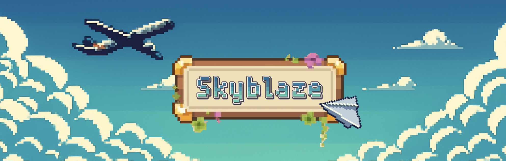
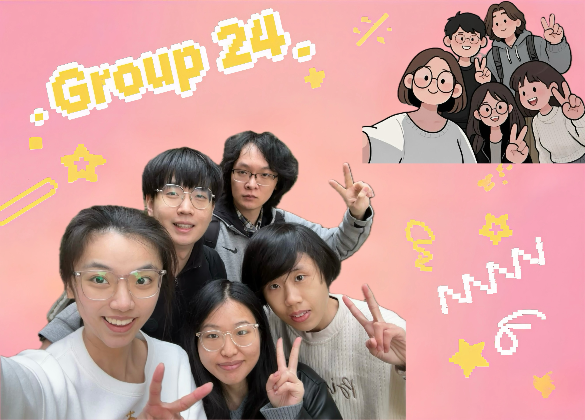
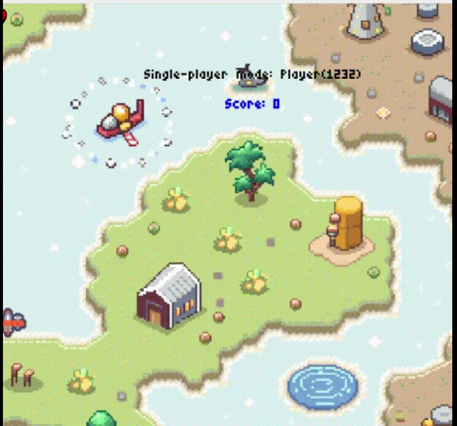
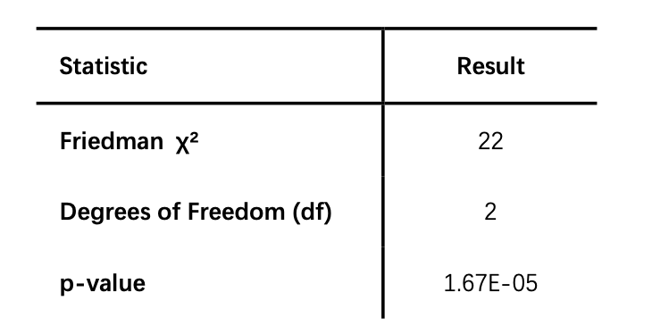
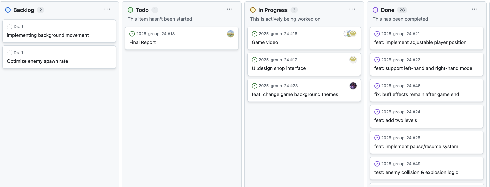

# 2025-group-24

  

## Try the Game Now

[**✈️ PLAY HERE**](https://uob-comsm0166.github.io/2025-group-24/)

[**💻 SOURCE CODE**](/docs)

## Demo Video

  

## Team

  

<table>
  <tr>
    <th>Name</th>
    <th>Email</th>
    <th>Username</th>
    <th>Role</th>
  </tr>
  <tr>
    <td>Xinjie Gao</td>
    <td><a href="mailto:id24861@bristol.ac.uk">id24861@bristol.ac.uk</a></td>
    <td>Gracie-Gao</td>
    <td>Report & User Analyst</td>
  </tr>
  <tr>
    <td>Zibin Liu</td>
    <td><a href="mailto:ys24930@bristol.ac.uk">ys24930@bristol.ac.uk</a></td>
    <td>ZibinLiu</td>
    <td>Project Manager & Developer</td>
  </tr>
  <tr>
    <td>Xiaobo Ma</td>
    <td><a href="mailto:oa24686@bristol.ac.uk">oa24686@bristol.ac.uk</a></td>
    <td>XiaoboMa1</td>
    <td>Software Test Engineer</td>
  </tr>
  <tr>
    <td>Kailin Fang</td>
    <td><a href="mailto:kfnora398@gmail.com">jd24317@bristol.ac.uk</a></td>
    <td>catlin518</td>
    <td>UI Designer</td>
  </tr>
  <tr>
    <td>Yanhao He</td>
    <td><a href="mailto:ei24967@bristol.ac.uk">ei24967@bristol.ac.uk</a></td>
    <td>YanHe225</td>
    <td>Developer</td>
  </tr>
</table>

## 1. Introduction

Our game is a pixel-style airplane shooter with roguelike elements, inspired by the classic arcade game _Space Invaders_. We introduced two-player mode and upgrade mechanics enhance the diversity of gameplay.

In terms of design, we implemented a random item drop system, where players can pick up various items during the battle. These items may provide positive effects (e.g., shields or buffs) or negative ones (e.g., fog), adding unpredictability and challenge to the game.

In addition to the single-player mode, the game also supports two-player co-op. In single-player mode, players can choose left-handed or right-handed mode, and choose to use WASD or arrow keys to control the aircraft according to their habits, which makes the operation more flexible.

The game contains three main levels, with increasing difficulty. Similar to roguelike mechanics, players can choose to upgrade their health, movement speed, or bullet damage after completing each level. Once they die midway through, the game will start over.

We anticipate that the game content will go through many revisions and iterations during the development process.  Therefore, we adopted an Agile workflow to stay flexible. This enabled our team to respond quickly to feedback, test new code regularly, and continuously improve the core game mechanics.

## 2. Requirements 

### 2.1  Early stages design & Ideation process
In the early stage of game design, each of us selected one or two games that we were interested in and added innovative ideas. After team discussion and voting, we chose two popular games: Airplane Wars and Fruit Catcher.

We first tried to create a basic game prototype for “Fruit Catcher”, in which the player moves the basket left and right to catch falling fruits to score points, while avoiding bombs. The game has a countdown timer and the player has to score as many points as possible within the time limit. 

  

However, due to the relatively simple gameplay, lack of continuous challenge, and limited interaction, we eventually decided to abandon this idea and proceed with the plane battle game. We had a general goal for the plane game: to expand the traditional single-player plane shooter by adding two-player mode, boss levels, and a local leaderboard. The prototype was designed as follows:

  

### 2.2  Use case diagrams & Use Case Specification
In order to show the interaction between the player and the system more clearly, we designed a use case diagram to describe the main functional modules of the game and the relationship between them. By analyzing the user's operation flow in different game modes, we can identify the key use cases (e.g., starting the game, selecting modes, checking the leaderboard, etc.), which provides an important reference for the subsequent development.

After clarifying the key use cases of the game, we provide a detailed Use Case Specification  for two of the core modes - Single Player Mode and Two-player Collaborative Mode. By describing the Basic Flow and Alternative Flow, we systematically sort out the whole process of the player from entering the game, choosing the control method, to succeeding or failing in the battle.
|               | Single Mode                                                                 | Cooperative Mode                                                                       |
|---------------------|------------------------------------------------------------------------------|----------------------------------------------------------------------------------------|
| **Description**     | The player controls a single aircraft to complete all levels, facing enemies, collecting items, and overcoming more challenges. | Two players each control an aircraft, collaborating to defeat enemies with strong teamwork. |
| **Basic Flow**      |                                                                              |                                                                                        |
| Step One            | The player selects single mode and enters a username.                        | Players select cooperative mode and enter two usernames.                               |
| Step Two            | Choose left-hand or right-hand control mode to start the game.              | Players cooperate to fight enemies, collect items, dodge attacks, and complete levels. |
| Step Three          | Fight enemies, collect items, dodge attacks, and complete the level.        |                                                                |
| **Alternative Flow**|                                                                              |                                                                                        |
| Step One            | If the player dies during the game, it resets and returns to the level start. | If either player dies, the game resets and returns to the level start.                 |
| Step Two            | The game can be resumed from the previous progress if paused.               | The game can be resumed from the previous progress if paused.                          |
| Step Three          | Players view their score and rankings after finishing the game.             | Players view their score and rankings after finishing the game.                        |

### 2.3 List of Stakeholders
  
- **01 – The Product or Service**  
  Our game — Sky Blaze
- **02 – The System**  
  Group 24: Developers, game maintainers, testers, and UI designers
- **03 – The Containing System**  
  Professors and classmates: Playtest the game and provide suggestions for improvement
- **04 – The Wider Environment**  
  Single players, co-op players, and the GitHub community — potential players or individuals who may be influenced by the game

  

### 2.4 User Stories & Acceptance Criteria

| **User Story** | **Acceptance Criteria** |
|----------------|--------------------------|
| **Epic 1: Core Gameplay** | |
| As a player, I want to control the airplane’s movement so that I can dodge enemy bullets and attack flexibly. | Given the airplane is in motion, when the player presses directional keys, then the airplane should respond smoothly without lag. |
| As a player, I want my airplane to gain points after shooting down an enemy airplane so that I can track my progress. | Given my airplane is in the game, when I successfully shoot down an enemy airplane, then I should gain points reflected in the score counter. |
| As a player, I want the airplane to lose health when hit by enemy bullets or crashes into enemy planes so that the game’s challenge increases. | Given the airplane has health points, when it is hit by bullets or crashes, then its health should decrease accordingly. |
| As a player, I want to unlock the next level after defeating a wave of enemy planes so that I can experience higher difficulty challenges. | Given the current wave is cleared, when the completion condition is met, then the next level should automatically unlock. |
| As a player, I want to play with friends on the same device for co-op mode so that I can increase fun. | Given I am on the game’s main menu, when I select the co-op mode option, then the game should allow two players to join on the same device. |
| **Epic 2: Game Interface & UX Optimization** | |
| As a player, I want to pause the game anytime so that I can take breaks without losing my progress. | Given the game is running, when the player presses pause, then the game should freeze. |
| As a player, I want to view historical high scores after the game ends so that I can motivate myself to improve. | Given the game has ended, when the player accesses the scoreboard, then the historical high scores should be displayed. |
| As a player, I want to switch between different game backgrounds so that I can enhance visual experience and freshness. | Given the settings menu is open, when the player selects a background, then the game should update the background. |
| As a game designer, I want to adjust the difficulty curve of each level so that the game remains challenging yet fair for all players. | Given the game’s progression system, when a player advances through levels, then the difficulty should increase gradually. |

In the process of developing the airplane battle mini game, our team learned a lot about requirements analysis from Epics and User Stories. Here are our key takeaways:

Firstly, we realize the importance of requirement decomposition. By refining the requirements into specific user stories, we have helped define the core gameplay and additional features more clearly, making the developers' design goals more specific.

Secondly, we recognize that the clarity of acceptance criteria is crucial. While writing user stories, we have defined acceptance criteria for each story to ensure that the developed features meet the expected results.

Thirdly, we realize that a multi-stakeholder perspective is crucial for product development. Through stakeholder analysis, we realized that we need to not only consider the gaming experience of players, but also pay attention to the technical implementation difficulty of the development team and the expectations of product managers for market positioning, to ensure that the game can meet the needs of different stakeholders.

## 3. Design

### 3.1 System architecture

Our game adopts a modular architecture using multiple JavaScript files, each of which is responsible for a specific aspect of gameplay or system management. This modular design promotes separation of concerns, code clarity, and easier debugging.

-   `event.js`: Acts as the central UI and input controller, managing button clicks, keyboard events, and user interface transitions.
    
-   `gameEnter.js`, `gameOver.js`, `roundFlow.js`: Handle game state transitions, including game start, end, round progression, and shop interactions.
    
-   `planeMove.js`, `bullet.js`: Control player interactions, including real-time movement and bullet generation.
    
-   `enemy.js`, `meteorite.js`, `buff.js`: Manage enemy creation, obstacle spawning, and power-up behavior.
    
-   `collisions.js`: Centralized module for collision detection and response logic.
    
-   `rank.js`: Handles high score storage, sorting, and display, triggered primarily by `gameOver.js` and powered by `localStorage`.
    
All game elements (players, enemies, bullets, buff) are represented as DOM elements with extended dynamic properties (e.g., `hp`, `type`, `dead`, `timer`), enabling object-like manipulation without using classical JavaScript classes. This design allows flexible, dynamic control of behaviors while maintaining performance and compatibility with DOM-based animations and updates.

### 3.2 Class diagrams
The initial class diagram  presented a simplified overview of our core game components, including the Game, Bullet, Enemy, Collision, buff, and controller files like planeMove and gameOver. At this stage, the diagram focused primarily on individual class responsibilities and basic aggregation relationships, especially those directly maintained by the central Game object.

As our development progressed, we expanded the system’s functionality and modularity. In the updated class diagram , we introduced additional controller classes such as:
- UIEventController for handling user input and interactions
- GameFlowManager for managing round flow and game state transitions
- Meteorite, a threat module with custom movement and collision handling
- Rank  for high score tracking

In earlier versions, the system included a bgMove module for visual background movement. This class was excluded from the final architecture as it did not align with our priority on performance efficiency.

### 3.3 Behavioural diagrams
To illustrate the runtime interaction among game components, we created a UML Sequence Diagram representing a full gameplay loop in both single and two-player modes.

At the start of the game, the GameFlowManager initiates plane generation via the Mode component. In single-player mode, a single plane is created; in two-player mode, two planes are initialized.

Once gameplay begins, players can fire bullets, triggering the Bullet system to move them and invoke the Collision module to detect impacts with enemies or buffs. Enemies may drop power-ups (Buff) when destroyed, which in turn modify various game states:
- Bullet speed-up and player shield are activated when players collect power-ups.
- Enemy speed-up and damage increase occur based on buffs or game difficulty scaling.
- The Blood system tracks health, and damage is applied upon collision.
- Game-over conditions are handled differently:
In single-player mode, the game ends when the player's health drops below zero.
In two-player mode, both players must have zero health for the game to end.

## 4. Implementation

### 4.1 Game Implementation: 
We divided the game into several distinct phases, including the introduction interface, the main gameplay, and the post-game summary. We first implemented the core part of the game—the aerial combat—then added an introduction screen and leaderboard before it, and a shop interface afterward to start the next round. This structure establishes a linear gameplay progression. During the development process, we encountered challenges both in programming itself and in managing various game elements, which we summarize into the following three categories:

### 4.2 Challenges
### Real-Time Game State Changes — Main Loop and Timers
To ensure the proper functioning of our game, various entities need to update in real time. By adding timers to different game entities and creating a loop framework, we’ve achieved smooth game operation and level progression.
Each subsystem in the game (movement, spawning, collision detection) is relatively independent and managed by multiple setInterval timers. These timers are configured with different intervals to control each subsystem individually. The gameStatus variable is used to uniformly control pause and resume functionality.
Within the main loop framework, these subsystems are executed in sequence. The main loop system is the core that enables the game to run smoothly. Every iteration of the loop is responsible for: Reading player input (keystrokes); Updating the positions of all entities (player, enemies, bullets, etc.); Checking for collisions; Redrawing the screen. In startMovement, movementTimer = setInterva l(function() is set with a 30ms refresh interval. In startEnemySpawn, enemyTimer = setInterval is configured with an 1800ms interval. Setting timers for different times ensures that the game starts as a player and then generates enemy planes and enemy bullets

  

  

  

### Collision Logic — Bounding Box Algorithm
Interactions between various entities in the game (player, enemies, treasures, bullets) are handled through collision detection.
The core logic of detecting a collision is to check whether the coordinates of two objects overlap.
The game uses the Bounding Box algorithm for collision detection. All entities (player aircraft, enemies, bullets, treasures) are treated as rectangles. Scaling factors are applied to adjust the actual size of each model.
A collision is considered to have occurred when the bounding boxes of two objects overlap. Specifically, the following four conditions must all be satisfied for a collision to be detected:
A’s right side ≥ B’s left side
A’s left side ≤ B’s right side
A’s bottom ≥ B’s top
A’s top ≤ B’s bottom

Each entity in the game contains four core properties: left coordinate, top coordinate, width, and height. Using two additional parameters, scalew and scaleh, the bounding values (top, bottom, left, right) of each entity can be accurately calculated. This allows entities of different sizes to share the same collision detection algorithm, simplifying the programming logic. Additional small helper methods are also integrated into the corresponding collision handling function. These methods handle post-collision effects such as:
Bullets disappearing
Enemies exploding
The player gaining score or losing HP
A screen shake effect to alert the player

  

  

  

### Complex Game Objects — Modular Design, Object-Oriented Thinking, DOM Combined with JavaScript to Represent Game Entities
Since modern browsers optimize CSS animations with hardware acceleration, they are often more efficient than animations implemented purely with JavaScript. Therefore, many of the visual effects in the game are handled by CSS, taking advantage of its separate rendering thread. This ensures that the game visuals remain smooth even when the JavaScript main thread is busy.
In this structure:
DOM elements serve as the visual presentation layer of the game.
JavaScript logic represents the internal data and behavior of game entities.
Together, they form a cohesive system for dynamic game presentation.  
Creation Phase:  
- A JavaScript object is created to represent a game entity
- A corresponding DOM element is generated
- Custom attributes are assigned to the element
- The element is added to the DOM tree  
Game Loop:
- JavaScript updates the object's state (e.g., position, HP)
- The updated state is synchronized to the DOM element (style.left, style.top, etc.)
- The browser re-renders the updated visuals

## 5. Evaluation

### **5.1 Qualitative Analysis**  

To evaluate the usability and player experience of the game, we conducted **Think Aloud** and **Heuristic Evaluation**. These two methods helped us identify key issues in the game, including controls, difficulty balance, and user interaction experience. Below are the detailed evaluation results and optimization plans.  

### **5.1.1 Think Aloud**  
We recruited 6 students as testers and asked them to complete two tasks:  
- **Task 1:** Pass the first two levels in single-player mode.  
- **Task 2:** Collect 5 items.  

During the test, we asked players to express their ideas loudly to record their operating habits and difficulties in the game. Through observation and analysis, we summarized the following main issues:  
- **Lack of a game tutorial:** The game does not provide any operation instructions, causing players to be unclear about how to control the aircraft when first entering the game. Some players had to try different keys to figure out the controls, which negatively impacted their experience.  
- **Low item spawn rate:** Testers could not collect 5 items after passing the first two levels, failing to meet our initial goal of using items as an innovation to attract players.  
- **High game difficulty:** Three players failed to pass the second level, indicating that the initial difficulty was set too high.  
- **Control scheme does not suit all players:** The current control scheme uses WASD for movement and F for shooting, but some players are accustomed to using their right hand for movement and left hand for shooting, making the controls feel unnatural and affecting the gameplay experience.  
- **Enemy planes are too small:** The small size of enemy planes makes them difficult to hit, which also contributed to the low level completion rate.  
- **Unclear item effects:** After picking up an item, players do not immediately understand its effects, resulting in players not being able to make full use of props.  
- **Bug - Bullets disappear after pausing:** When players pause and resume the game, enemy bullets disappear.  

To address these issues, we propose the following optimizations:  
- Add a **game tutorial** to introduce basic controls (movement, shooting) at the beginning.  
- **Increase item spawn rate** to ensure players can collect enough items within a reasonable time.  
- **Lower the score requirement** for early levels, allowing players to gradually adapt to the difficulty.  
- **Add an option to switch control schemes** in single-player mode:  
  - **Left-hand mode:** WASD for movement, F key for shooting.  
  - **Right-hand mode:** Arrow keys for movement, Enter key for shooting.  
- **Increase enemy plane size** and adjust their sizes based on health to improve hit accuracy.  
- **Display item effects** upon pickup (e.g., "+5% speed boost").  
- **Fix the pause logic** to ensure all dynamic objects (bullets, enemies) resume correctly after pausing.  

### **5.1.2 Heuristic Evaluation**  
Based on the issues discovered in the Think Aloud evaluation, we further conducted Heuristic Evaluation, inviting three students to participate. This method follows Nielsen's 10 Heuristic Principles** to analyze the game’s usability from a professional perspective.  
In addition to the problems identified in Think Aloud, testers provided further key suggestions. The heuristic evaluation scoring table is as follows:

| **Interface**  | **Issue Description**        | **Violated Heuristic Principle** | **Frequency (0-4)** | **Impact (0-4)** | **Persistence (0-4)** | **Severity (F+I+P)/3** |
|--------------|--------------------------|------------------------------|----------------|----------------|----------------|----------------|
| **Game Interface** | Background movement is not smooth, affecting immersion | H8: Aesthetic and Minimalist Design | 4 | 2 | 1 | 2.33 |
| **Game Interface** | Fixed aircraft size, no visible health indicator | H4: Consistency and Standards | 4 | 3 | 4 | 3.67 |

Testers pointed out that the static background affects the **immersion** of the game and suggested implementing **background scrolling** to enhance dynamic visuals and realism. Additionally, the fixed aircraft size makes it difficult for players to assess their health status. It was recommended to **adjust aircraft size dynamically** or add a **UI health bar** above the aircraft to provide a clearer indication of remaining health.

### **5.2 Quantitative Analysis**

To verify whether there are significant differences in the difficulty levels of the three game stages, we conducted a **NASA TLX test** and applied the **Friedman test** for statistical analysis. In this study, we used convenience sampling to select 11 participants to complete the NASA TLX questionnaire, using **Raw TLX scores** as the evaluation metric.

The table below shows the **NASA TLX scores** of the 11 players at different levels:

  

We conducted a **Friedman test** using R, and the results are as follows:

  

Since the **p-value is less than 0.05**, there is a significant difference in NASA TLX scores across different levels. This indicates that as the game progresses, players perceive a significant increase in workload, verifying the gradual increase in the difficulty of the game.

Additionally, we plotted the **TLX score distribution box plot** for different levels (Level 1-3) (as shown in the figure):

  

The median **TLX score continues to rise** as levels increase, indicating a gradual increase in game difficulty. **Level 1** has a lower and narrower distribution of TLX scores, suggesting that players experience lower cognitive and physical workload in the initial level. The gradual increase in scores in **Levels 2-3** indicates a gradual increase in the player's perceived workload. This is consistent with the game design intent of **gradually increasing the challenge of the game**.

### **5.3 Description of how code was tested**
### 5.3.1. Workflow & Methodology
We employed a three-layer pyramid across development cycles:
- Unit Tests (30%): Focused on isolated functions using Jest.
- Integration Tests (45%): Validated interactions between subsystems (e.g., buffs affecting enemy speed).
- E2E Tests (25%): Simulated user journeys (e.g., single-player mode navigation).

For early-stage modules (e.g., collision detection, enemy spawning), we implemented white-box unit tests using Jest to validate internal logic. As the game matured, we moved to Cypress-based E2E tests to simulate user interactions and validate UI workflows. After each test session, we produced detailed reports, including failure recordings, screenshots, problematic code patches, and improvement suggestions. All artifacts are version-controlled under the "test" branch for reference.

### 5.3.2. Test Architecture & Modules
Below is the structural breakdown of major tests and their purposes:

| Test File | Type | Target Module | Key Features Validated |
|-----------|------|--------------|------------------------|
| bullet_and_enemy_spec.cy.js | Integration | Bullet/Enemy Mechanics | Bullet generation/removal, enemy movement, collision detection logic |
| buff_and_effects_spec.cy.js | Integration | Buff System & Timed Effects | Treasure drops, shield activation, speed buffs, fog effects, timer-based deactivation |
| enemy_collision_spec.cy.js | Integration | Enemy-Player Interaction | Health deduction, game over triggers, alert handling |
| ui_and_flow_spec.cy.js | E2E (Black-box) | UI Navigation & Game Flow | Homepage visibility, mode selection, player name input, round popup behavior |
| integrate_spec.cy.js | Integration | Basic Game Structure | Homepage elements, control interactions, game initialization |

### 5.3.3. Key Findings & Improvements

We validated boundary conditions (e.g., plane exceeding screen limits) and achieved ~85% code coverage for critical modules (collision, buffs, UI flow) via Cypress's built-in instrumentation and Jest coverage reports. 

As development iterations continued and project functionality expanded, testing allowed us to quickly identify incompatibilities with the original architecture, make adjustments, maintain connections between different features, correctly preserve states, evaluate edge cases, thereby improving system robustness and user experience. Through testing, we pinpointed and resolved critical bugs, for example:

| Issue | Problem | Solution | Impact |
|-------|---------|----------|--------|
| Timer Leak in moveTreasure() | Intervals for treasure movement weren't cleared when treasures were removed | Added clearInterval() to removeTreasure() function | Prevented buff malfunctions and errors from operations on removed DOM elements |
| Buff Stacking Problems | Speed boosts overwrote previous buffs instead of stacking | Changed assignment operations to cumulative calculations with proper restoration on expiry | Ensured correct stacking of multiple buffs (e.g., 50% + 50% = 100% speed increase) |
| Missing Buff Expiration UI | Players received no visual feedback when buffs expired | Added expiration notifications that auto-remove after 2 seconds | Improved player awareness of active buff status |
| Background Scroll Timer Issues | Background animation continued during pause, wasting resources | Added timer clearing logic when gameStatus = false | Prevented stuttering and rendering issues when toggling pause |
| Internal Logic Inconsistencies | Duplicate HTML IDs in leaderboard, hardcoded meteorite dimensions | Assigned unique IDs, standardized meteorite configuration | Ensured correct state management during code expansion |

## 6. Process 

In this project, our group collaborated to develop a pixel style airplane war mini-game, incorporating roguelike elements and referencing the classic arcade game Space Invaders. In order to enhance the game experience, we introduced a two-player collaboration mode, a props random drop system, and a level upgrading mechanism to make the overall gameplay richer and more challenging. 

In terms of teamwork, we adopted the **Agile Workflow** methodology for organization and management. The entire development cycle was divided into several short Sprints, each with a cycle of about two weeks. At the beginning of each sprint, we hold a Sprint Planning meeting** to define the main development goals and assign tasks for this phase.
In order to better manage the development progress, we built a Kanban Kanban board in our GitHub project, which divides the task management into four main sections. First, **Backlog (Pending Options)** is used to include all planned tasks that are pending development or refinement. Second, **Todo** lists the tasks that have been identified and will be started soon, making it easy for the team to prioritize. Next, **In Progress** records the tasks that are currently under development, ensuring that all members have a clear understanding of the current focus and resource allocation. Finally, **Done** shows the results that have been completed and passed the initial acceptance, covering functional development (e.g., implementation of the game over mechanism, bullet and enemy collision detection), documentation (e.g., user stories, class diagrams, and timing diagrams), and project deliverables (e.g., uploading the final report and the video of the game's paper prototype demo), and so on.

Each task card is labeled with a specific development goal, and as development progresses, the task card moves from the “Pending” to the “In Progress” and finally to the “Completed” column. This visualization process helps team members clearly understand the overall project status and quickly identify potential problems during development.

During the development process, we also used **GitHub** as a platform for version control and collaborative development. Each member develops features independently on their own branch, submits code via Pull Request, and conducts Code Review within the group to ensure code quality and feature stability.

For daily communication, we use a combination of **Microsoft Teams** and **WeChat**. Teams is mainly used for scheduling meetings, sharing files and progress, while WeChat is used as an instant communication tool for quickly identifying issues, synchronizing progress, and scheduling ad-hoc discussions. This dual-channel communication allows us to maintain an efficient flow of information in different scenarios.

During the Sprint, we held Scrum meetings every 2 to 3 days. Each Daily Stand-up is usually limited to 15 minutes or less, and team members share their work progress in turn, focusing on three main issues: what tasks were accomplished yesterday, what tasks are planned for today, and whether they have encountered any obstacles or need assistance in solving problems. Through this high-frequency, short-term and efficient communication, we were able to synchronize our progress in a timely manner, identify potential problems, and quickly adjust our development plan to ensure that the project moved forward steadily.

Through high-frequency synchronized communication, we were able to identify technical difficulties or resource conflicts encountered during the development process in a timely manner and quickly adjust the development plan. For example, in a Daily Stand-up, we discovered a logical loophole in the scoring mechanism in time and quickly organized personnel to fix it, avoiding the impact on subsequent development.

In terms of division of roles, we made a clear division based on members' specialties in order to improve the overall efficiency of collaboration. **Project Manager (Scrum Master)** is responsible for coordinating the project progress, organizing all kinds of meetings and monitoring the overall work status to ensure the smooth progress of the development process. The **Program Developer** is responsible for building the game framework, completing the implementation of core functions such as player control, enemy generation, level design and upgrade mechanism. The **System Testing** staff took on the responsibility of continuous testing and bug tracking to ensure the stability and reliability of each feature before it goes live. Meanwhile, the **Art Designer** was responsible for drawing pixel-style art resources such as airplanes, enemy planes, props, and interface buttons.

| Name        | Contribution |
|-------------|--------------|
| Xinjie Gao  | 1            |
| Zibin Liu   | 1            |
| Xiaobo Ma   | 1            |
| Kailin Fang | 1            |
| Yanhao He   | 1            |

Throughout the development process, we adopted an Agile workflow combined with the Kanban method, GitHub for version control, and efficient communication platforms such as Microsoft Teams and WeChat. This approach allowed us to maintain clear progress management and smooth team collaboration. Through continuous small-step iterations, regular feedback, and ongoing process improvements, we successfully advanced the project while significantly enhancing the team’s overall communication and collaboration capabilities.

## 7. Sustainability, ethics and accessibility 

As software engineers, we are not only responsible for the functionality of our systems, but also for their long-term impact on individuals, society, and the environment. As emphasized in the Karlskrona Manifesto and SusAF, designing with sustainability in mind means understanding the broader consequences of our systems and intentionally shaping them to create positive change. In this section, we reflect on the environmental, individual, and technical impacts of our game project. 

### 7.1 Environmental Impact
In terms of environmental sustainability, we have implemented strategies to **reduce energy consumption, lower carbon emissions, and ease server load**, aiming to minimize the environmental impact of our game.

We recognize that modern browsers consume a lot of energy when processing media resources, especially when a game continues to run in the background after the player has left. Since our game is designed for long-term sessions and may experience extended pauses, we ensure that music playback, and other resource-consuming activities are suspended during periods of inactivity. This prevents unnecessary use of CPU, memory, and GPU resources, **reducing the power consumption of the user's device**.

Our ranking system uses local caching to minimize server requests and reduce resource consumption, particularly when dealing with outdated data from inactive users. This helps prevent the server (especially from handling legacy user data) from becoming overloaded.

### 7.2 Individual Impact
Our game has a positive impact on **mental health, physical comfort, privacy, and learning ability**.

On the **psychological level**, the game adopts a PVE (player vs environment) model that emphasizes combat, progression, and a sense of growth. It is structured into three levels with increasing difficulty, which reduces the sense of failure and frustration. The game is easy to start and play at any time, with a relaxed pace that helps relieve anxiety and stress, providing players with a casual and comforting experience. Moreover, the ranking system is stored locally without online connectivity or global competition, avoiding comparison-induced pressure and supporting mental well-being.

On the **physical level**, the game supports both left-handed and right-handed operation modes, reducing strain on one hand. The UI elements are appropriately sized and do not overburden the eyesight. Even if you play for a long time, you can maintain a certain level of physical comfort.

In terms of **privacy and safety**, the ranking data is stored locally, and users can clear it at any time. This ensures that no personal information is exposed externally.

In terms of **lifelong learning**, the game features simple rules that can be learned within a few minutes. This stimulates brain activity while avoiding the frustration often caused by high learning barriers.

### 7.3 Technical Impact
From a technical perspective, we paid special attention to **maintainability, usability, adaptability, and scalability**.

First, in terms of **usability**, we have reduced the amount of text and enhanced the use of visual elements to make the game content easier to understand for users of all ages and cultural backgrounds. The color scheme is comfortable, and the interface buttons are clear and intuitive, which improves the overall user experience.

Second, in terms of **adaptability**, the game supports multiple operating systems and browser versions (e.g., Chrome, Safari), allowing users to run the game smoothly without the need to update their devices.

In terms of **maintainability and scalability**, the project structure is well-organized and modular, which facilitates future feature expansion and issue resolution.

We also note the **security** dimension: by storing data locally, we avoid risks associated with online data transmission. Additionally, reducing unnecessary network requests not only improves loading speed but also enhances the overall system stability.

## 8. Conclusion

This project is a pixel-style airplane battle game that integrates Roguelike elements and supports both single-player and two-player modes. From the early stage of requirement analysis, user stories, and use case design to the later stages of code implementation, functional testing, and user evaluation, we went through a complete agile development process. The project not only improved our practical skills in team collaboration, software development, and usability testing, but also deepened our understanding and application of software sustainability through the SusAF framework.

During development, we faced several technical and collaborative challenges. On the technical side, implementing real-time game state switching and pause functionality required coordination between the main game loop and timers. The complex collision detection logic was efficiently handled by introducing the Bounding Box algorithm. To improve performance and maintainability, we used JavaScript for game logic, DOM and CSS to render visuals. On the team side, one originally planned member had to withdraw from the project due to personal reasons, which increased the workload for the rest of the team. However, through frequent communication, task decomposition, and flexible role adjustments, we were still able to achieve our project goals.

Throughout the process, we realized the importance of clear requirements and testable design. By breaking down user stories into specific acceptance criteria, we were able to rapidly develop, validate, and iterate on features. Frequent stand-up meetings and kanban board helped us stay aligned, resolve conflicts, and coordinate resources effectively, significantly improving our development efficiency.

For future work, we plan to expand the game's functionality in several ways to enhance playability and immersion:

- Enhance the visual and audio feedback for hits, explosions, and shield activation;
- Add boss battles to increase challenge;
- Introduce more types of enemies with different behaviors to diversify gameplay;
- Add plot transitions between levels to enhance immersion;
- Add the friend battle mode to enhance the interaction and competitive fun;
- Battle replay and performance sharing function, record players' battles and allow them to save their moments;
- Optimization of auxiliary functions, support for color blind mode, low visual intensity mode, to enhance the inclusiveness;
- Add AI Enemies and a Tutorial Mode to Support New Players;
- Allow players to freely choose and switch between various aircraft and bullet styles, with support for personalized skin customization;
- In-Game Shop and Item Exchange Using Points;
- Support touch controls on mobile devices to expand user groups.
    
In conclusion, this project was not only the development of a complete game but also a comprehensive practice of the “software sustainability” concept. Despite facing member changes and technical difficulties, we successfully delivered a product that is fun, expandable, and offers a good user experience through teamwork, iteration, and continuous improvement.

